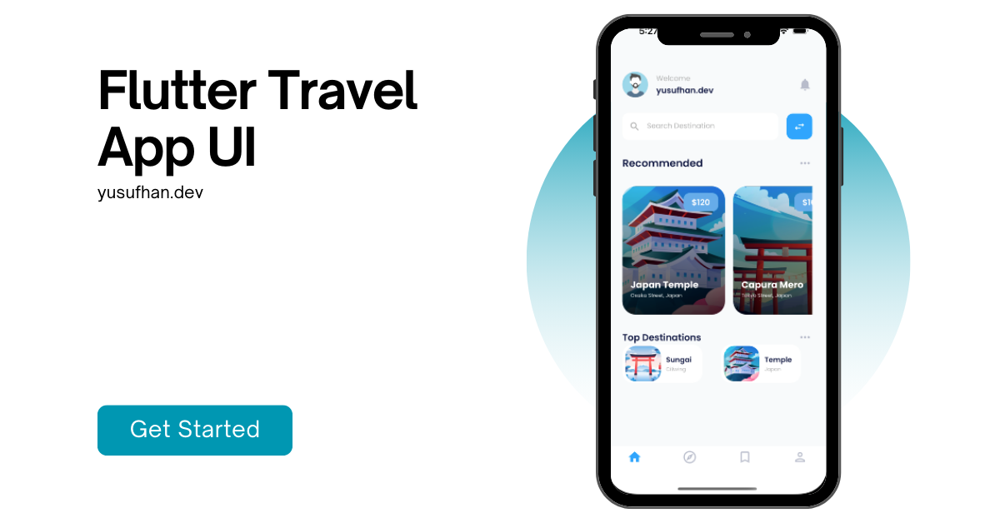
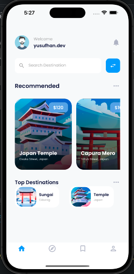

# Flutter Travel App Landing Page UI



Design Credits: Arya Wijaya Kusuma
[View on Dribbble](https://dribbble.com/shots/15793197-Travel-App)

## Description

This venture presents a contemporary and adaptable user interface (UI) for a travel app's landing page, developed using Flutter. The UI is meticulously crafted to seamlessly adjust to diverse screen dimensions, catering to an array of devices ranging from smartphones to tablets. It boasts an elegant design that emphasizes an exceptional user journey, offering an instinctive flow for users exploring the world of travel.

## Features

- Responsive UI design that adapts to various screen sizes.
- Clean and modern user interface for a pleasant user experience.
- Easily customizable components to tailor the home screen to your app's branding.

## Screenshots



## Getting Started

Follow the steps below to set up the project on your local machine and run it:

1. Clone the repository:

```bash
git clone https://github.com/JosephDoUrden/Flutter-Travel-App-UI
cd Flutter-Travel-App-UI/
flutter run
```

## Contact

If you have any questions, feedback, or would like to connect, feel free to reach out to me.

- **Name:** Yusufhan Saçak
- **Email:** yusufhan.sacak@bahcesehir.edu.tr
- **Website:** https://medium.com/@yusufhansacak
- **Twitter:** [@0xSCK](https://twitter.com/0xSCK)
- **LinkedIn:** [Yusufhan Saçak](https://www.linkedin.com/in/yusufhansacak/)

Feel free to contact me through any of the channels above. I'm open to collaborations and discussions related to Flutter development or any other projects.
